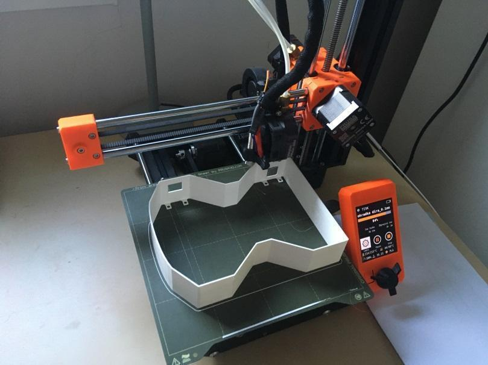
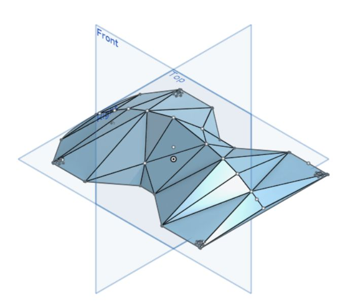
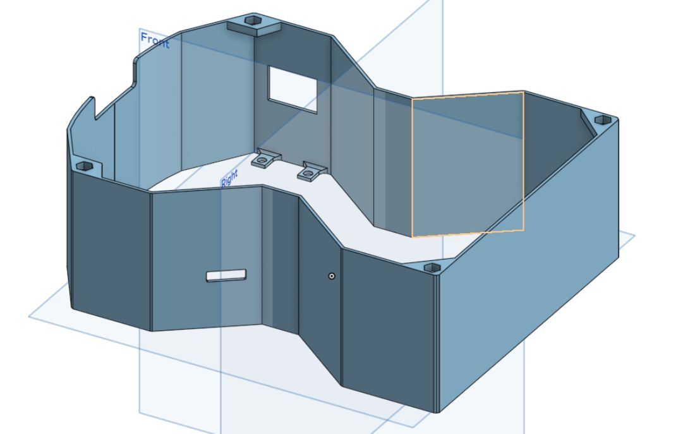
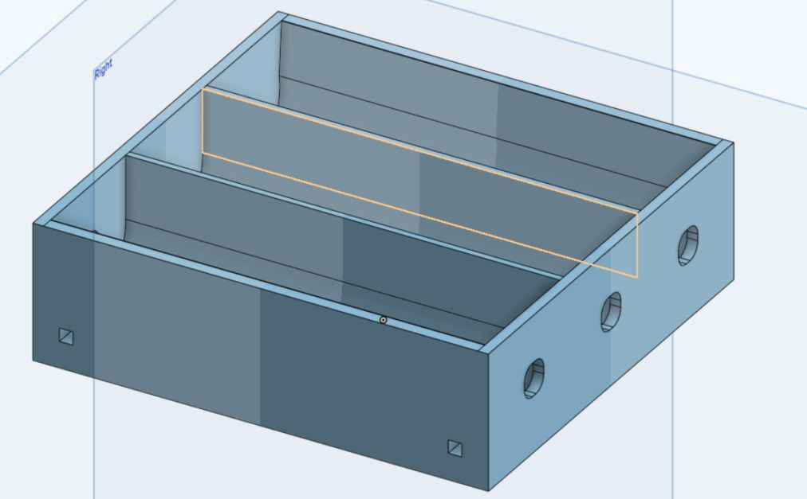
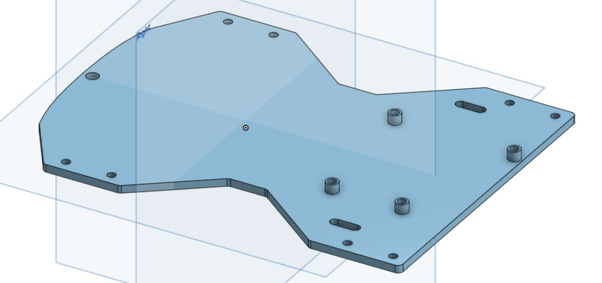
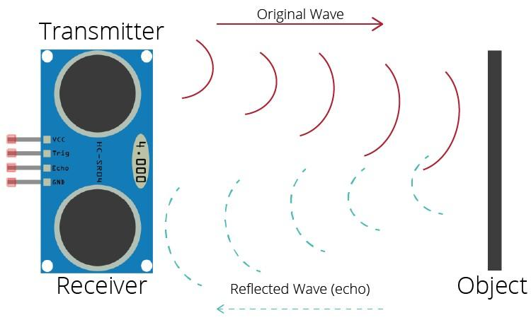
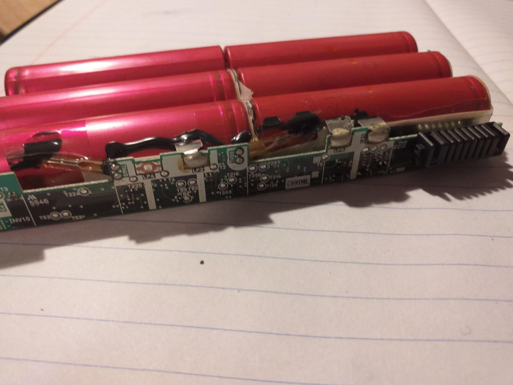
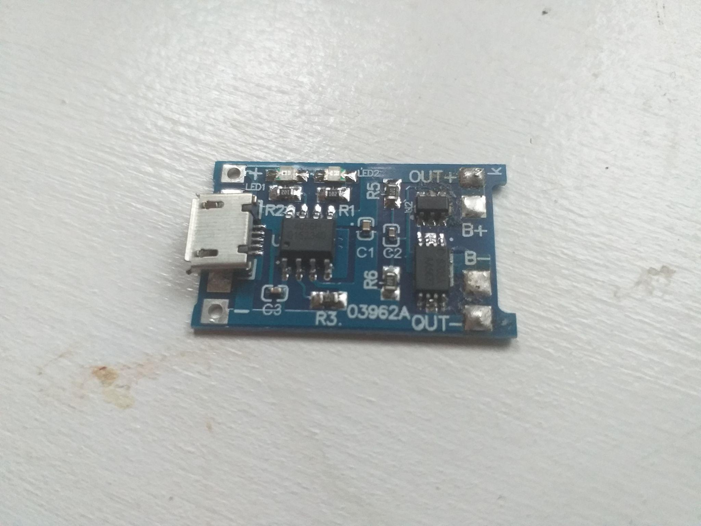
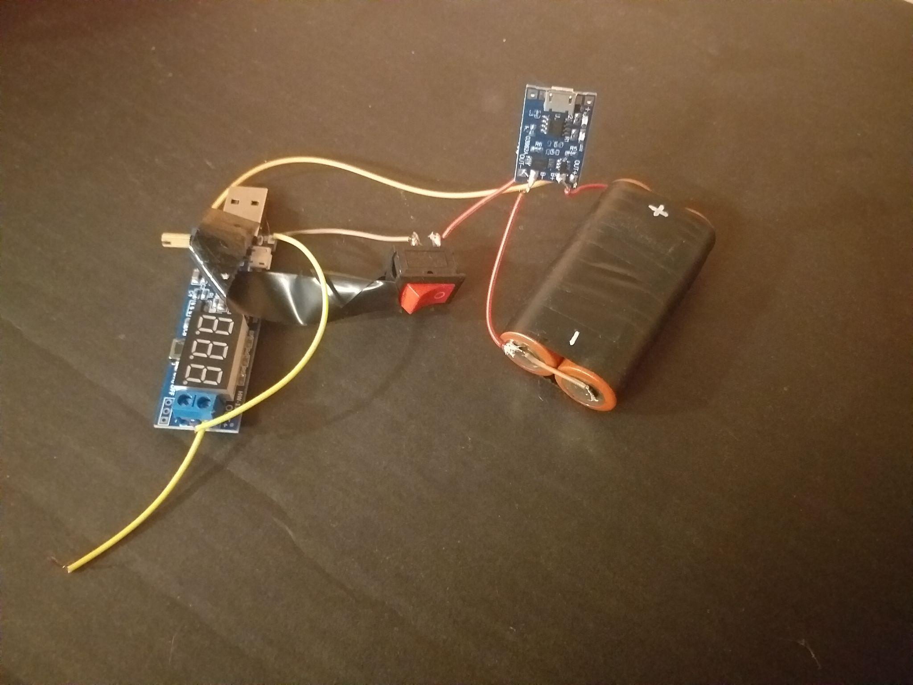
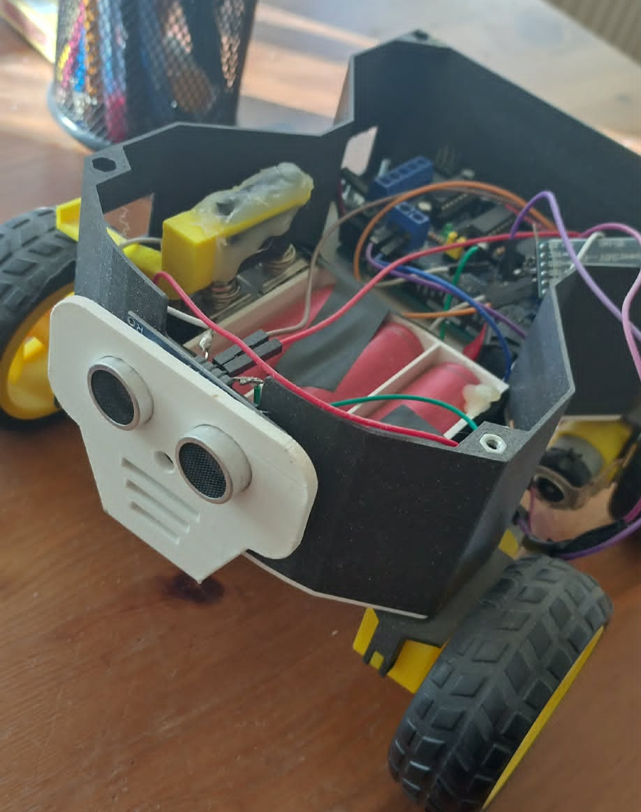

# Bluetooth Car Controller

Bluetooth Car Controller is an Android + Arduino project for driving a Bluetooth-enabled RC car from a phone. The app supports manual joystick driving, sensor-assisted safety settings, and an autonomous scan mode, while the Arduino firmware executes motor and ultrasonic sensor logic.

## Project Overview

This project combines:

- **Android app (Java)** for Bluetooth pairing, control UI, and mode switching
- **Arduino firmware (.ino)** for motor control and obstacle sensing
- **HC-05 Bluetooth communication** using a simple byte-based command protocol

The Android app sends movement and mode commands, and the Arduino controller interprets them to drive the motors and react to sensor input.

## Features

- **Manual driving mode** with a virtual joystick (direction + speed)
- **Bluetooth device management** (discover, list paired devices, connect)
- **Sensor mode** to enable/disable obstacle braking and configure braking distance
- **Autopilot scan mode** with live obstacle plotting on a custom canvas
- **Connection state feedback** shown directly in control screens
- **Bottom navigation workflow** for quick switching between Joystick, Autopilot, Sensor, and Bluetooth screens

## Architecture / Structure

```text
BluetoothCarController/
├── src/main/java/com/example/bluetoothcarcontroller/
│   ├── MainActivity.java                    # Command routing, navigation, shared control helpers
│   ├── Bluetooth/
│   │   ├── Device.java
│   │   └── DeviceAdapter.java               # Device list rendering + RFCOMM connection
│   ├── Fragments/
│   │   ├── JoystickFragment.java            # Manual drive controls
│   │   ├── AutopilotFragment.java           # Automatic mode toggle + canvas screen
│   │   ├── SensorFragment.java              # Sensor settings and distance update
│   │   └── BluetoothFragment.java           # Device discovery and pairing UI
│   ├── Threads/
│   │   └── ReceiveDataThread.java           # Reads distance data stream for autopilot canvas
│   └── Canvas/
│       └── AutopilotCanvasView.java         # Pan/zoom obstacle visualization
├── src/main/res/                            # Layouts, drawables, strings, themes
├── arduinoCarController/arduinoCarController.ino
│                                            # Main firmware used by Android app protocol
└── AvoidObstacle.ino                        # Alternative obstacle-avoidance sketch
```

### High-level flow

1. User connects to the car's Bluetooth module (typically HC-05) from the app.
2. Control fragments send command bytes through `DeviceAdapter` output stream.
3. Arduino firmware maps command bytes to motor actions and sensor behaviors.
4. In autopilot mode, Arduino sends scan distance values back to Android.
5. `ReceiveDataThread` parses incoming values and `AutopilotCanvasView` renders points.

## Build & Run Instructions

### Prerequisites

- **Android Studio** (with Android SDK for API 30)
- **Arduino IDE**
- **Hardware**: Arduino-compatible car, motor driver shield (`AFMotor`), ultrasonic sensor, HC-05 Bluetooth module
- **Android device** with Bluetooth support

### 1) Flash the Arduino firmware

1. Open `arduinoCarController/arduinoCarController.ino` in Arduino IDE.
2. Install required libraries (if missing):
   - `AFMotor`
   - `SoftwareSerial` (typically built-in)
3. Select board/port and upload the sketch.
4. Power the car and verify the HC-05 module is discoverable.

### 2) Build and install Android app

1. Open the project root in Android Studio.
2. Let Gradle sync and install dependencies.
3. Build and run on a physical Android device.
4. Grant requested Bluetooth and location permissions.
5. In the app, open the **Bluetooth** tab and connect to the HC-05 device.

### 3) Operate modes

- **Joystick**: manual steering and speed control
- **Autopilot**: start/terminate scan mode
- **Sensor**: enable/disable braking sensor and set braking distance

## Testing

Current automated test coverage is minimal:

- `src/androidTest/java/com/example/bluetoothcarcontroller/ExampleInstrumentedTest.java` validates app context on an Android device/emulator.

To run instrumentation tests:

1. Connect a device (or start an emulator).
2. Run Android instrumentation tests from Android Studio (`androidTest`).

Recommended practical verification after build:

- Confirm Bluetooth discovery and successful connection to HC-05.
- Verify joystick movement maps to expected motor direction/speed.
- Verify sensor toggle and braking distance update are applied on the car.
- Verify autopilot mode sends/receives data and updates the canvas.

## Project Context

This repository is a student/learning-style embedded-mobile integration project focused on:

- Real-time Bluetooth command/control between Android and Arduino
- Combining manual and assisted navigation modes in one control app
- Basic onboard obstacle sensing with optional autonomous scan behavior

The codebase is organized for direct experimentation with control logic, communication protocol tuning, and UI iteration for robotics-style mobile control.

## Visuals

This section contains curated visuals from the project presentation.

### Modeling snapshots








### Hardware and mapping






### Final product


---

If you plan to continue development, consider adding a protocol reference table (command byte -> behavior), hardware wiring diagram, and expanded automated tests for communication and UI flows.
